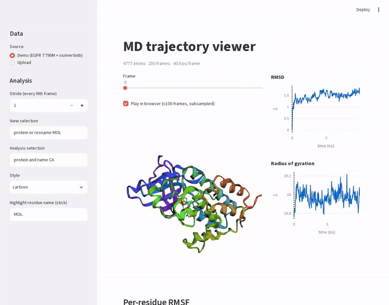

# MD trajectory viewer

**Live demo:** https://md-trajectory-viewer.streamlit.app/

**Question.** A browser tool to load, play and analyse molecular dynamics trajectories.



## Data
Topology + trajectory files (PDB/GRO + XTC/DCD); demo data from the egfr-mmgbsa runs.

## Approach
1. Streamlit + MDAnalysis + 3Dmol.js (loaded from a CDN in the browser) + Plotly
2. Frame slider with 3D view; live RMSD and radius of gyration (Plotly)
3. Per-residue RMSF and MDAnalysis selection syntax
4. Striding/subsampling and upload limits for large files; pytest for analysis functions

## Deliverables
Deployed app with a demo trajectory and a GIF in this README.

## Run
```bash
python -m venv .venv && . .venv/bin/activate
pip install -r requirements.txt
streamlit run app.py          # demo trajectory loads by default
pytest                        # analysis functions
```
Upload limit is 200 MB per file (`.streamlit/config.toml`). Use the stride control for long trajectories.

## Demo data
`demo/egfr_T790M_osimertinib.{pdb,xtc}`: EGFR T790M kinase domain with osimertinib, protein + ligand only,
250 frames over 10 ns, cut from a 10 ns explicit-solvent run of the egfr-mmgbsa project with
`scripts/make_demo.py` (unwrapped, centred on the protein, solvent and ions removed).

## Status
App works locally with the demo trajectory: frame slider and in-browser playback, RMSD, radius of gyration,
per-residue RMSF, MDAnalysis selection syntax, upload with size limit. Deployed on Streamlit Community Cloud (the app sleeps when idle; wake it with the button).
Part of a 30-project computational biology and scientific software portfolio.
